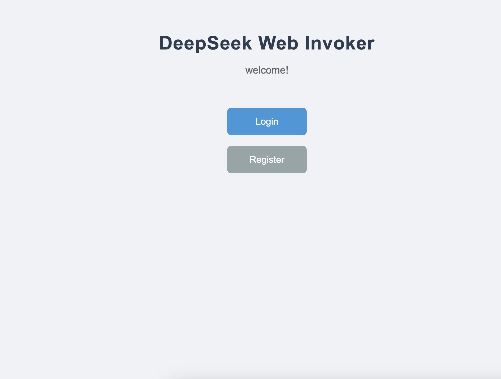
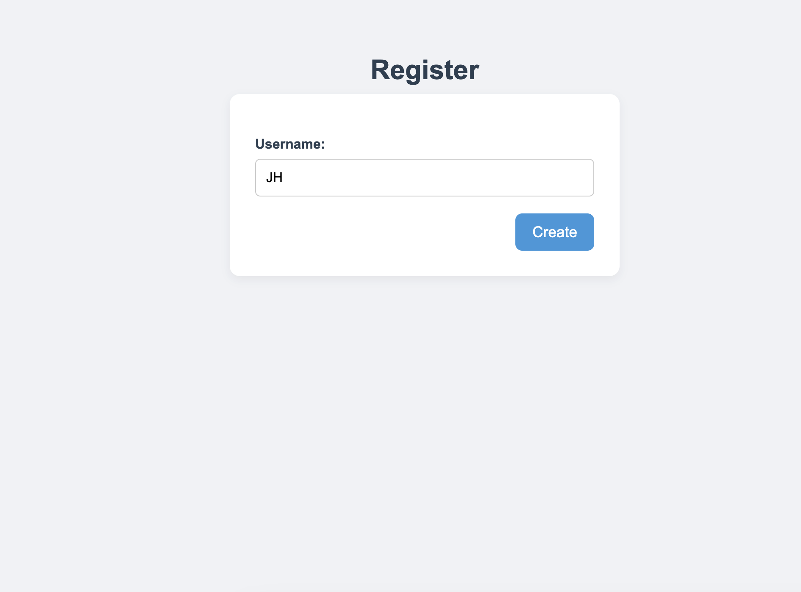
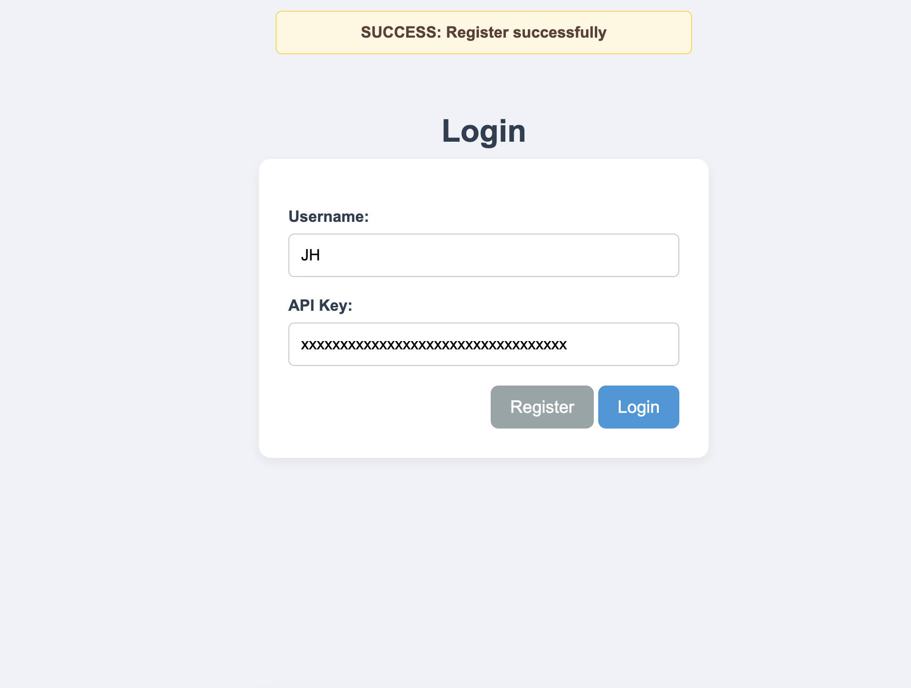
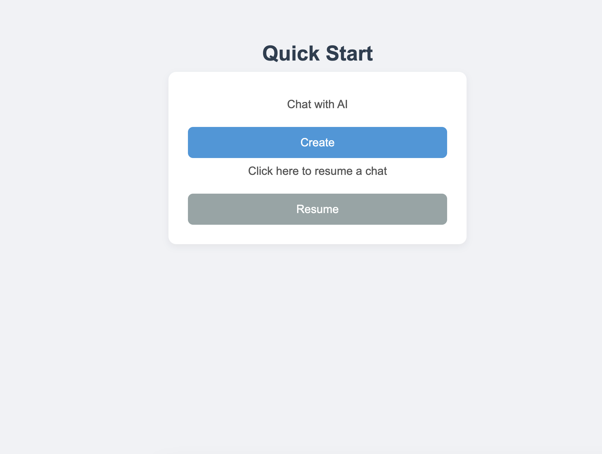
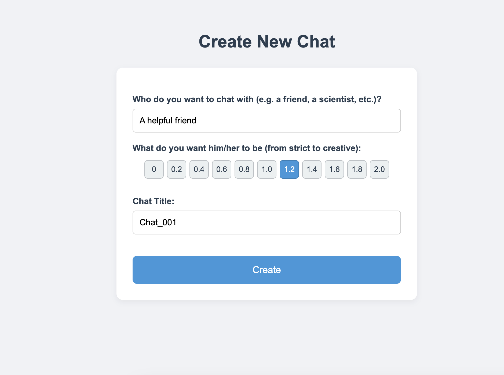
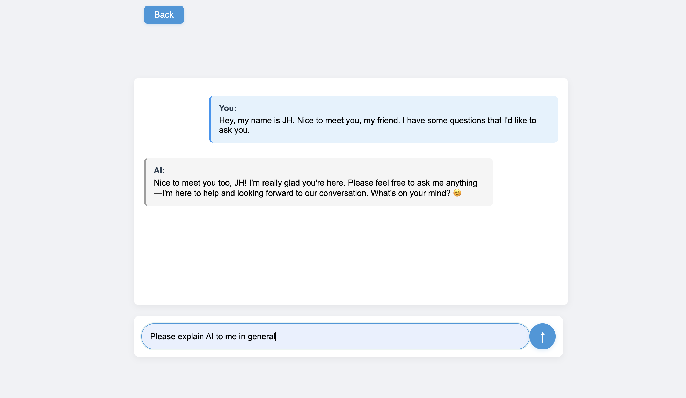
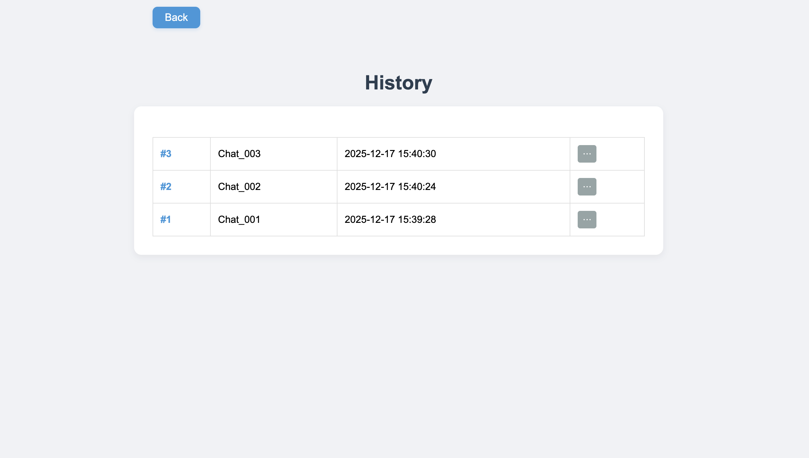
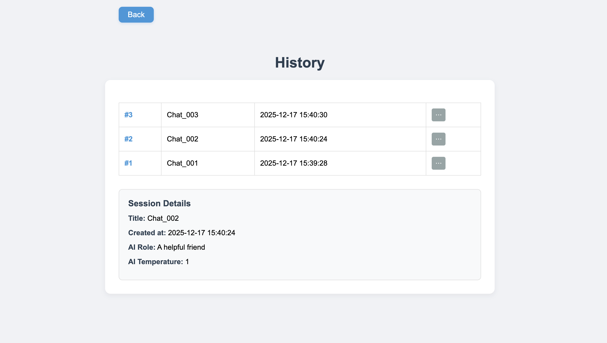

# Deepseek Invoker Web

* Introduction: This is a website that calls the DeepSeek API, simply encompassing common features of AI websites such as registration, login, creating or selecting sessions, and conversations. It utilizes the Flask framework with a SQLite-driven database. 

* Notably, pop-up messages are implemented through Flask's flash functionality, and all buttons are handled via HTML redirects or form POST submissions (the conversation feature does not use streaming transmission). Viewing session details is achieved through simple JavaScript. 

## URL Overview

* `/`
    * 

* `/register`
    * 

* `/login`
    * 

* `/chat`
    * 

* `/chat/create`
    * 

* `/chat/<int:session_id>`
    * 

* `/chat/history`
    * 
    * After clicking to expand the details: 